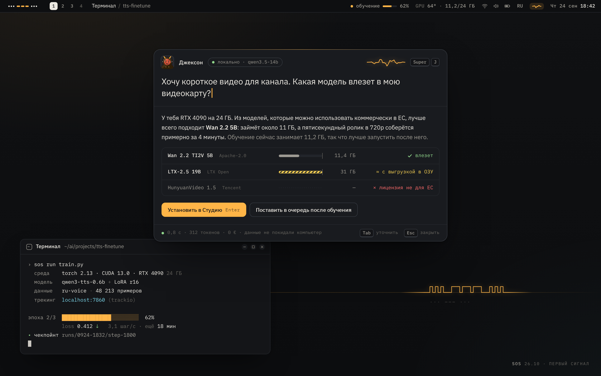

<div align="center">

<h3><samp>··· ——— ···</samp></h3>

<h1>SOS — Svoya Operating System</h1>

<b>«СОС» — Своя Операционная Система</b>

Your own OS for AI. Local-first. Under your control.<br>
Своя ОС для ИИ. Локально. Под твоим контролем.

<br>

<!-- Add the REUSE badge once the repository is registered at api.reuse.software:
     [](https://api.reuse.software/info/github.com/svoya-os/sos) -->

[](docs/ROADMAP.md)
[](LICENSE)
[](https://github.com/svoya-os/sos/actions/workflows/ci.yml)
[](https://github.com/svoya-os/sos/actions/workflows/iso.yml)

<br><br>



<sub>Design mockup, Graphite theme. Not a screenshot: SOS is pre-alpha.
Also: <a href="design/out/desktop-paper.png">Paper</a> (day) · <a href="design/out/desktop-phosphor.png">Phosphor</a>.</sub>

<br><br>

**[English](#english)** · **[По-русски](#по-русски)**

</div>

<br>

## English

SOS (Svoya Operating System) is an open-source Linux distribution for working with AI.
Underneath is Ubuntu 26.04 LTS, used as an invisible engine. Everything you see and touch is
ours: the Svoya Shell desktop, the assistant Jackson, and the `sos` command.

### What it is

This is the design. What works today is listed under [Status](#status).

- **GPU, set up and checked.** Signed drivers from the engine archive, a driver pool on the ISO
  for offline installs, and GPU Doctor (`sos gpu`), which checks driver ↔ CUDA ↔ PyTorch,
  Secure Boot, suspend/resume and GPU access from containers; `sos fix` applies the safe fixes.
  The OS owns the driver; each project brings its own CUDA, so versions stop fighting.
- **Jackson, a friendly guy who asks first.** Jackson («Джексон») is a laid-back dude from the
  2000s internet who calls you «кентафурик» (buddy): cheeky, but he gets things done. He routes requests to local or cloud models and runs tools
  and other agents (Claude Code, Codex, OpenCode, goose…) in sandboxes. Before anything risky he
  shows the exact action, he keeps a tamper-evident log, and he can undo what he did. Call him
  with `Super+J`, or type `j` in a terminal: `j find my datasets`. His memory is plain Markdown,
  and it can live in your Obsidian vault.
- **The AI toolbox as modules.** Nothing is forced. The first-run wizard asks for a profile
  (Newcomer, Creator, ML Engineer, Agent Builder, Hacker, or offline only), suggests one local
  model that fits your GPU and memory, and installs it with one click if you want it. Add or
  remove modules at any time, for example `sos install comfyui`: Local LLMs · Studio (image,
  video, voice) · ML Lab · Agents · Dev · Cloud burst. Every tool reads models from one store,
  `/srv/ai`, so nothing downloads twice. Before a download starts, SOS tells you whether the
  model fits and whether its license allows your use.
- **Svoya Shell.** A desktop built from scratch on Quickshell and Hyprland. Graphite by night,
  Paper by day, Phosphor for CRT fans. Matte surfaces instead of glass, IBM Plex type, one signal
  color, the Morse mark. Floating windows and the mouse by default; tiling is a preset.
- **Undo for everything.** Btrfs snapshots before every update, module change and action
  Jackson takes. `Super+Z` or `sos undo` reverts the last change; yesterday's system is one
  entry in the boot menu.

### The promise

Published and binding. If SOS breaks one of these, that is a bug, and we treat privacy bugs as
security bugs.

- **No ads, no upsells, no account, no telemetry.** Crash reports only if you opt in.
- **AI never starts by itself.** One switch turns every AI feature off, and every AI component
  can be removed.
- **Local by default.** Every request that leaves your machine is visible, along with what it cost.
- **Everything is reversible:** updates, modules, settings and every action Jackson takes.
- **Your data is plain files** you can read, move and delete.

What leaves your machine, and when: [docs/guides/privacy.md](docs/guides/privacy.md).

### How it compares

| | SOS | Omarchy | Ubuntu 26.04 | Bluefin GDX | Pop!_OS |
|---|---|---|---|---|---|
| Local AI ready out of the box | ✔ modules + fit check | manual | snaps (partial) | CLI tools | — |
| Assistant with sandbox, audit, undo | ✔ Jackson | coding agents only | voice typing (26.10) | — | — |
| One switch to turn AI off | ✔ | — | — | — | n/a |
| Driver + Secure Boot without key enrollment | ✔ (signed) | — | ✔ | enroll key | disable SB |
| Rollback of updates | ✔ snapshots | ✔ snapshots | — | ✔ image | — |
| Newcomer-friendly (floating windows, mouse) | ✔ + tiling preset | tiling only | ✔ | ✔ | ✔ |

<sub>Our reading of each project's documentation as of September 2026. If we got something
wrong, please open an issue and we will fix it.</sub>

### Status

**Pre-alpha.** Work on **v0.1 «Первый сигнал» (First Signal)** is in progress, and nothing here
is ready for daily use yet. But the system boots: every change on `main` is built into an ISO and
booted in a virtual machine by CI (BIOS, UEFI, UEFI with Secure Boot), which takes screenshots of
the boot menu, the desktop, the launcher and Jackson. Those test builds can be tried today, see
[Quick start](#quick-start).

v0.1 is planned to include: a bootable ISO; Svoya Shell (bar, launcher, Jackson panel,
notifications, lock screen, greeter); Jackson in text mode (local and cloud routing, tools,
permission tiers, audit log, undo); the `sos` command (GPU Doctor and fixes, modules, the model
store, themes, updates and undo); the Graphite, Paper and Phosphor themes; and CI that boots and
screenshots every build.

After that: v0.2 «Голос» (Voice), v0.3 «Поводок» (Leash), then v1.0.
Checklists are in the [roadmap](docs/ROADMAP.md).

### Hardware

SOS targets 64-bit PCs (amd64) with UEFI.

| GPU | Support | Notes |
|---|---|---|
| NVIDIA GeForce RTX 20, 30, 40, 50 series | **Primary** | Current driver branch with NVIDIA's open kernel modules, signed, so Secure Boot stays on. CUDA comes per project. The GTX 16 series runs on the same driver. |
| NVIDIA GeForce GTX 900 and 1000 series | Legacy | Driver branch 580, NVIDIA's last for Maxwell and Pascal. CUDA 12.x only: CUDA 13 dropped these cards, and many current AI tools have too. |
| AMD Radeon RX 7000 (RDNA 3), RX 9000 (RDNA 4), Ryzen AI Max (Strix Halo) | Supported | Mesa for graphics, ROCm for compute; llama.cpp also runs on Vulkan. ROCm officially covers only some cards, and `sos gpu` shows where yours stands. Strix Halo's large shared memory suits big models. |
| Intel Arc (A and B series) | Basic | Desktop and video work. AI through Vulkan (llama.cpp); other stacks are untested. |
| No GPU (CPU only) | Works | The whole system works; local AI is limited to small models. |

Other hardware that runs Ubuntu 26.04 will most likely boot and run the desktop, but AI
acceleration there is untested. ARM machines are not supported yet.
Tried SOS on your machine? A
[hardware report](https://github.com/svoya-os/sos/issues/new?template=hardware.yml) helps a lot.

### Quick start

**Try it in a virtual machine** (about 15 minutes, nothing on your computer changes):

1. Download a test build: [Actions → ISO](https://github.com/svoya-os/sos/actions/workflows/iso.yml)
   → the top run with a green check → *Artifacts* → **sos-iso** (needs a GitHub account; releases
   will be on [GitHub Releases](https://github.com/svoya-os/sos/releases)).
2. Unzip it and join the parts. Windows (PowerShell):
   `cmd /c copy /b sos-26.10-amd64.iso.part00 + sos-26.10-amd64.iso.part01 sos-26.10-amd64.iso`;
   Linux/macOS: `cat sos-26.10-amd64.iso.part* > sos-26.10-amd64.iso`. Check it against `SHA256SUMS`.
3. VirtualBox: *Linux / Ubuntu (64-bit)*, 8 GB of memory, 4 CPUs, *Enable EFI*, graphics *VMSVGA*
   with 3D on, start it with the ISO.
4. You are on the desktop of the live session. Look around (`Super+K` shows every shortcut), then
   press **«Install SOS»** in Jackson's greeting to put it on a disk.

The [install guide](docs/guides/install.md) has every step, USB sticks, Hyper-V, QEMU and
troubleshooting. The short version for both languages: [INSTALL.md](INSTALL.md).

**Build from source:**

```sh
git clone https://github.com/svoya-os/sos.git
cd sos
```

Then follow [docs/guides/build-from-source.md](docs/guides/build-from-source.md): building the
packages and the ISO (Linux, or Windows with WSL2 and Docker), the tests, and running the shell,
Jackson and the `sos` command from a checkout.

After installing: [first steps](docs/guides/first-steps.md) · [FAQ](docs/guides/faq.md).

### Repository map

Inside the system, and in package and path names, the technical name is `svoya`
(`svoya-*` packages, `/usr/share/svoya/`, `~/.config/svoya/`).

| Path | What | Ships as |
|---|---|---|
| `image/` | ISO build: mmdebstrap → squashfs → hybrid ISO | build tooling |
| `installer/` | Calamares settings and branding | `svoya-installer` |
| `packages/` | Debian packaging for every `svoya-*` package | `.deb` |
| [`shell/`](shell/) | Svoya Shell (Quickshell/QML), login screen in `shell/greeter/` | `svoya-shell` |
| [`jackson/`](jackson/) | Jackson: the background service and the `j` command (Python) | `svoya-jackson` |
| [`cli/`](cli/) | the `sos` command, also available as `svoya` (Python) | `svoya-cli` |
| [`modules/`](modules/) | module catalog (TOML) | `svoya-cli` |
| [`themes/`](themes/) | theme tokens (TOML) and templates | `svoya-theme` |
| [`branding/`](branding/) | logo, wallpapers, boot and login themes, sounds | `svoya-branding` |
| [`design/`](design/) | design system, mockups, fonts | not shipped |
| `tests/` | unit and VM (QEMU/QMP) tests | CI |
| [`docs/`](docs/) | [vision](docs/VISION.md), [architecture](docs/ARCHITECTURE.md), [roadmap](docs/ROADMAP.md), [guides](docs/guides/) | website |

### Contributing

Help is welcome, and some of the most useful help needs no code: hardware reports, testing,
Russian and English translations, and documentation.

- Start with [CONTRIBUTING.md](CONTRIBUTING.md). Sign off your commits (DCO, `git commit -s`).
  There is no CLA.
- AI-assisted contributions are fine if you have reviewed and tested them yourself and say so
  in the pull request.
- Changes to Jackson's permissions, sandboxing, packaging or signing need two reviews.
- Everyone follows the [Code of Conduct](CODE_OF_CONDUCT.md). How decisions are made:
  [GOVERNANCE.md](GOVERNANCE.md).

### Security

Please do not open public issues for vulnerabilities. Report them privately through GitHub:
**Security → Report a vulnerability**. Details and scope: [SECURITY.md](SECURITY.md).

### License

- Code: [Apache-2.0](LICENSE).
- Artwork and documentation: [CC BY-SA 4.0](LICENSES/CC-BY-SA-4.0.txt).
- Fonts: IBM Plex under [OFL-1.1](LICENSES/OFL-1.1.txt), Departure Mono under [MIT](LICENSES/MIT.txt).
- Icons: [Lucide](https://lucide.dev) under [ISC](LICENSES/ISC.txt) (its Feather-derived icons also [MIT](LICENSES/MIT.txt)).
- Code of Conduct: Contributor Covenant 2.1, [CC BY 4.0](LICENSES/CC-BY-4.0.txt).

The license of every file is recorded in [REUSE.toml](REUSE.toml) and in file headers, following
the [REUSE](https://reuse.software) specification. Full texts are in [LICENSES/](LICENSES/).

### Trademarks

"SOS" and "Svoya Operating System" as the name of this system, «СОС», «Своя Операционная
Система» and the Morse mark `··· ——— ···` are trademarks of the SOS project (maintainer:
LIFKURU OÜ). The code license does not cover them. Community use is free. Modified builds need
their own name but may say "based on SOS". Details: [TRADEMARKS.md](TRADEMARKS.md) (draft).

SOS is not related to the `sos` support tool (sosreport). Ubuntu is a registered trademark of
Canonical Ltd. SOS is not affiliated with or endorsed by Canonical. Other names are trademarks of
their owners.

<br>

## По-русски

«СОС» — Своя Операционная Система — открытый дистрибутив Linux для работы с ИИ. Внутри — пакеты
Ubuntu 26.04 LTS, невидимый движок. Всё, что ты видишь и трогаешь, — наше: рабочий стол
Svoya Shell, Джексон и команда `sos`.

### Что это

Ниже — какой система задумана. Что работает уже сейчас, смотри в разделе [«Статус»](#статус).

- **Видеокарта настроена и проверена.** Подписанные драйверы из архива движка, запас драйверов
  прямо на ISO для установки без интернета и «Доктор GPU» (`sos gpu`): он проверяет связку
  «драйвер ↔ CUDA ↔ PyTorch», Secure Boot, сон и пробуждение, доступ к GPU из контейнеров, а
  `sos fix` применяет безопасные исправления. Драйвер — забота системы, а CUDA у каждого проекта
  своя, поэтому версии больше не воюют между собой.
- **Джексон — свой в доску чувак, который сначала спрашивает.** Он родом из интернета нулевых,
  зовёт тебя «кентафурик» и говорит «базару нет»: с шуточками, но дело делает. Джексон отправляет запросы локальным или облачным моделям,
  запускает инструменты и других агентов (Claude Code, Codex, OpenCode, goose…) в песочницах.
  Перед рискованным шагом показывает, что именно сделает, ведёт журнал, который нельзя незаметно
  подправить, и умеет отменять свои действия. Зови его по `Super+J` или прямо из терминала:
  `j найди мои датасеты`. Память он хранит в обычных Markdown-файлах, можно — в твоём
  хранилище Obsidian.
- **Инструменты ИИ — модулями.** Ничего не навязываем. Мастер первого запуска спросит профиль
  (Новичок, Автор, ML-инженер, Разработчик агентов, Хакер или «только офлайн»), подберёт одну
  локальную модель под твою видеокарту и память и поставит её в один клик, если захочешь.
  Модули добавляешь и убираешь когда угодно, например `sos install comfyui`: локальные модели ·
  Студия (картинки, видео, голос) · ML-лаборатория · Агенты · Разработка · Облачные GPU. Все
  инструменты берут модели из одного хранилища, `/srv/ai`, так что ничего не скачивается
  дважды. Ещё до загрузки СОС скажет, влезет ли модель и разрешает ли лицензия твой сценарий.
- **Svoya Shell — свой рабочий стол.** Написан с нуля на Quickshell и Hyprland. Графит ночью,
  Бумага днём, Фосфор для тех, кто скучает по ЭЛТ-мониторам. Матовые поверхности вместо стекла,
  шрифты IBM Plex, один сигнальный цвет, знак азбукой Морзе. По умолчанию — плавающие окна и
  мышь, тайлинг включается отдельным пресетом.
- **Всё можно отменить.** Снимки Btrfs перед каждым обновлением, сменой модулей и действием
  Джексона. `Super+Z` или `sos undo` откатывает последнее изменение, а вчерашняя система — один
  пункт в загрузочном меню.

### Обещание

Опубликовано и обязательно к исполнению. Если СОС нарушает хоть один пункт, это ошибка, а
нарушения приватности мы считаем ошибками безопасности.

- **Без рекламы, навязанных покупок, аккаунта и телеметрии.** Отчёты о сбоях — только если ты
  сам их включишь.
- **ИИ никогда не запускается сам.** Один переключатель выключает все функции ИИ, а любой
  ИИ-компонент можно удалить.
- **Локально по умолчанию.** Каждый запрос, который уходит с компьютера, виден, как и его
  стоимость.
- **Всё обратимо:** обновления, модули, настройки и каждое действие Джексона.
- **Твои данные — обычные файлы:** их можно прочитать, перенести и удалить.

Что и когда уходит с компьютера — в [docs/guides/privacy.md](docs/guides/privacy.md)
(на английском).

### Сравнение

| | СОС | Omarchy | Ubuntu 26.04 | Bluefin GDX | Pop!_OS |
|---|---|---|---|---|---|
| Локальный ИИ готов сразу после установки | ✔ модули + проверка «влезет ли» | вручную | snap-пакеты (частично) | консольные утилиты | — |
| Ассистент с песочницей, журналом и отменой | ✔ Джексон | только агенты для кода | голосовой ввод (26.10) | — | — |
| Один переключатель, чтобы выключить ИИ | ✔ | — | — | — | неприменимо |
| Драйвер и Secure Boot без регистрации ключа | ✔ (подписан) | — | ✔ | нужно зарегистрировать ключ | нужно выключить SB |
| Откат обновлений | ✔ снимки | ✔ снимки | — | ✔ образ | — |
| Удобно новичку (плавающие окна, мышь) | ✔ + пресет тайлинга | только тайлинг | ✔ | ✔ | ✔ |

<sub>Так мы понимаем эти проекты по их документации на сентябрь 2026 года. Если где-то
ошиблись — открой issue, поправим.</sub>

### Статус

**Пре-альфа.** Идёт работа над **v0.1 «Первый сигнал»**, и для повседневной работы система пока
не готова. Но она уже загружается: каждое изменение в `main` CI собирает в ISO и запускает в
виртуальной машине (BIOS, UEFI, UEFI с Secure Boot), снимая скриншоты меню загрузки, рабочего
стола, поиска и Джексона. Такие тестовые сборки можно попробовать уже сейчас — см.
[«Быстрый старт»](#быстрый-старт).

В v0.1 должны войти: загрузочный ISO; Svoya Shell (панель, лаунчер, панель Джексона,
уведомления, экран блокировки, экран входа); текстовый Джексон (локальные и облачные модели,
инструменты, уровни разрешений, журнал, отмена); команда `sos` («Доктор GPU» и исправления,
модули, хранилище моделей, темы, обновления и отмена); темы Графит, Бумага и Фосфор; CI, который
загружает каждую сборку и делает скриншоты.

Дальше — v0.2 «Голос», v0.3 «Поводок» и v1.0. Списки задач — в
[дорожной карте](docs/ROADMAP.md) (на английском).

### Железо

СОС рассчитана на 64-битные ПК (amd64) с UEFI.

| Видеокарта | Поддержка | Подробности |
|---|---|---|
| NVIDIA GeForce RTX 20, 30, 40, 50 | **Основная** | Актуальная ветка драйвера с открытыми модулями ядра NVIDIA. Модули подписаны, Secure Boot выключать не нужно. CUDA — своя у каждого проекта. GTX 16 работает на том же драйвере. |
| NVIDIA GeForce GTX 900 и 1000 | Устаревшая | Ветка драйвера 580 — последняя, в которой NVIDIA поддерживает Maxwell и Pascal. Только CUDA 12.x: CUDA 13 эти карты уже не поддерживает, многие свежие ИИ-инструменты тоже. |
| AMD Radeon RX 7000 (RDNA 3), RX 9000 (RDNA 4), Ryzen AI Max (Strix Halo) | Поддерживается | Графика — Mesa, вычисления — ROCm; llama.cpp работает и через Vulkan. Официально ROCm поддерживает не все эти карты — `sos gpu` покажет, как обстоят дела с твоей. У Strix Halo много общей памяти, и это удобно для больших моделей. |
| Intel Arc (серии A и B) | Базовая | Рабочий стол и видео работают. ИИ — через Vulkan (llama.cpp), остальное не проверяли. |
| Без видеокарты (только CPU) | Работает | Вся система работает, из локального ИИ — только небольшие модели. |

Другое железо, на котором работает Ubuntu 26.04, скорее всего, загрузится, и рабочий стол на
нём будет работать, но ускорение ИИ там никто не проверял. Компьютеры на ARM пока не
поддерживаются. Попробовал СОС на своей машине?
[Отчёт о железе](https://github.com/svoya-os/sos/issues/new?template=hardware.yml) очень поможет.

### Быстрый старт

**Попробовать в виртуальной машине** (минут 15, на компьютере ничего не поменяется):

1. Скачай тестовую сборку: [Actions → ISO](https://github.com/svoya-os/sos/actions/workflows/iso.yml)
   → верхний запуск с зелёной галочкой → *Artifacts* → **sos-iso** (нужен аккаунт GitHub; релизы
   будут на [GitHub Releases](https://github.com/svoya-os/sos/releases)).
2. Распакуй и склей части. Windows (PowerShell):
   `cmd /c copy /b sos-26.10-amd64.iso.part00 + sos-26.10-amd64.iso.part01 sos-26.10-amd64.iso`;
   Linux/macOS: `cat sos-26.10-amd64.iso.part* > sos-26.10-amd64.iso`. Сверь с `SHA256SUMS`.
3. VirtualBox: *Linux / Ubuntu (64-bit)*, 8 ГБ памяти, 4 ядра, «Включить EFI», графика *VMSVGA*
   с 3D, запусти с этим ISO.
4. Ты на рабочем столе живой сессии. Осмотрись (`Super+K` покажет все сочетания клавиш), а потом
   нажми **«Установить СОС»** в приветствии Джексона, чтобы поставить систему на диск.

Все шаги, флешки, Hyper-V, QEMU и решения проблем — в [руководстве по установке](docs/ru/install.md).
Короткая версия на двух языках — [INSTALL.md](INSTALL.md).

**Собрать из исходников:**

```sh
git clone https://github.com/svoya-os/sos.git
cd sos
```

Дальше — по [docs/guides/build-from-source.md](docs/guides/build-from-source.md) (на
английском): сборка пакетов и ISO (Linux или Windows с WSL2 и Docker), тесты, запуск оболочки,
Джексона и команды `sos` прямо из репозитория.

После установки: [первые шаги](docs/ru/first-steps.md) · [вопросы и ответы](docs/ru/faq.md).

### Что где лежит

Внутри системы, в именах пакетов и путях техническое имя — `svoya` (пакеты `svoya-*`,
`/usr/share/svoya/`, `~/.config/svoya/`).

| Путь | Что внутри | Во что собирается |
|---|---|---|
| `image/` | сборка ISO: mmdebstrap → squashfs → гибридный ISO | инструменты сборки |
| `installer/` | настройки и оформление Calamares | `svoya-installer` |
| `packages/` | Debian-пакеты для всех `svoya-*` | `.deb` |
| [`shell/`](shell/) | Svoya Shell (Quickshell/QML), экран входа — в `shell/greeter/` | `svoya-shell` |
| [`jackson/`](jackson/) | Джексон: работа в фоне и команда `j` (Python) | `svoya-jackson` |
| [`cli/`](cli/) | команда `sos`, она же `svoya` (Python) | `svoya-cli` |
| [`modules/`](modules/) | каталог модулей (TOML) | `svoya-cli` |
| [`themes/`](themes/) | токены тем (TOML) и шаблоны | `svoya-theme` |
| [`branding/`](branding/) | логотип, обои, темы загрузки и входа, звуки | `svoya-branding` |
| [`design/`](design/) | дизайн-система, макеты, шрифты | не входит в систему |
| `tests/` | модульные тесты и тесты в ВМ (QEMU/QMP) | CI |
| [`docs/`](docs/) | [видение](docs/VISION.md), [архитектура](docs/ARCHITECTURE.md), [дорожная карта](docs/ROADMAP.md), [руководства](docs/ru/) | сайт |

### Как помочь

Помощь нужна, и самая полезная часто вообще без кода: отчёты о железе, тестирование, переводы
на русский и английский, документация.

- Начни с [CONTRIBUTING.md](CONTRIBUTING.md). Подписывай коммиты (DCO, `git commit -s`),
  CLA не нужен.
- Вклад, сделанный с помощью ИИ, принимаем, если ты сам его проверил и протестировал и
  написал об этом в pull request.
- Изменения в разрешениях и песочницах Джексона, в пакетах и подписях проходят два ревью.
- Все участники следуют [Кодексу поведения](CODE_OF_CONDUCT.md). Как принимаются решения —
  в [GOVERNANCE.md](GOVERNANCE.md).

### Безопасность

Об уязвимостях, пожалуйста, не пиши в открытые issue. Сообщай закрыто через GitHub:
**Security → Report a vulnerability**. Подробности — в [SECURITY.md](SECURITY.md).

### Лицензия

- Код — [Apache-2.0](LICENSE).
- Графика и документация — [CC BY-SA 4.0](LICENSES/CC-BY-SA-4.0.txt).
- Шрифты: IBM Plex — [OFL-1.1](LICENSES/OFL-1.1.txt), Departure Mono — [MIT](LICENSES/MIT.txt).
- Значки: [Lucide](https://lucide.dev) — [ISC](LICENSES/ISC.txt) (значки, взятые из Feather, ещё и [MIT](LICENSES/MIT.txt)).
- Кодекс поведения: Contributor Covenant 2.1, [CC BY 4.0](LICENSES/CC-BY-4.0.txt).

Лицензия каждого файла записана в [REUSE.toml](REUSE.toml) и в заголовках файлов по
спецификации [REUSE](https://reuse.software). Полные тексты лицензий — в [LICENSES/](LICENSES/).

### Товарные знаки

«СОС», «Своя Операционная Система», а также SOS и Svoya Operating System как название этой
системы и знак `··· ——— ···` — товарные знаки проекта СОС (мейнтейнер — LIFKURU OÜ). Лицензия
на код на них не распространяется. Сообществу пользоваться ими можно свободно. Изменённые
сборки нужно назвать по-своему, но писать «основано на СОС» можно. Подробности — в
[TRADEMARKS.md](TRADEMARKS.md) (черновик).

СОС не имеет отношения к утилите поддержки `sos` (sosreport). Ubuntu — зарегистрированный
товарный знак Canonical Ltd. СОС не связана с Canonical и не одобрена ею. Прочие названия
принадлежат их владельцам.
